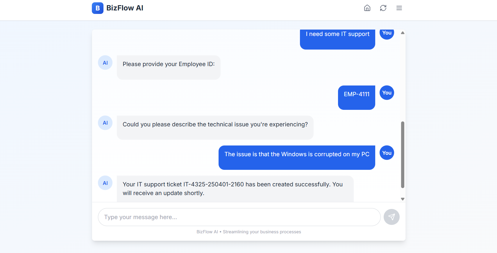

# BizFlow AI

## Introduction

Welcome to BizFlow AI! This enterprise-grade conversational assistant has been developed using the open source machine learning framework [Rasa](https://rasa.com/). BizFlow AI is designed to streamline internal business processes by handling both structured (transactional) workflows and open-ended (informational) queries. Whether you need to raise an IT support ticket, submit an expense report, book a meeting room, or retrieve the latest HR policy, BizFlow AI is here to assist.

## About Rasa

Rasa is an open-source machine learning framework that empowers you to build robust conversational AI assistants. It is composed of two primary components:

1. **Rasa NLU** - Handles natural language understanding.
2. **Rasa Core** - Manages dialogue flow and decision-making.

With BizFlow AI, these components are leveraged together with the Rasa CALM approach, which seamlessly integrates structured flows with Retrieval-Augmented Generation (RAG) for dynamic information retrieval.

## Getting Started

Before getting started with the chatbot, make sure you have the following requirements installed:

- Python 3
- pip (package manager for Python)

To install Rasa, you can use the following pip command: ` `
``pip install rasa-pro``

Once rasa has been installed, clone this repository and navigate to the directory containing the chatbot files.
``git clone https://github.com/dawoodwasif/BizFlow-AI.git``

## Training the Chatbot

To train the chatbot, you can use the following command: 
``rasa train``

## Running the Chatbot

**Step 1: To run the chatbot, you can use the following command:** 
``rasa run --enable-api --cors "*"``

**Step 2: For basic validations you need to be connected to action server**  
To run the action server, you can use the following command: 
``rasa run actions``

**Step 3: Accessing the chatbot via RASA CLI**  
Now we have the Rasa server up and running, and the chatbot will be available to chat with through the Rasa command line interface.
To talk with the bot, you can use the following command: 
``rasa shell``

## Instead of running chatbot via CLI, you can run it via *Node*

``cd frontend``  
``npm i``  
``npm run dev``  

## Screenshot of the App

  
     
  

## BizFlow Conversation Flow Diagram Graph

  

# Conclusion

BizFlow AI is designed to be a flexible, scalable, and enterprise-ready solution that combines the strengths of transactional process automation with dynamic knowledge retrieval. With integrations into backend systems and support for open-source and fine-tuned language models, it is well-suited for modern businesses looking to streamline their internal operations.

For more details on customizing your assistant’s responses, flows, or integrating additional backend systems, please refer to the Rasa documentation.
